# Lost in Los Angeles: How to Find Parking (and Community) with ParkMobile

### _by Tasia Mochernak // Digital Humanities 150 at UCLA, Winter 2020 // Dr. Sookie Cho_

With this UX design analysis, I'd like to contribute to the vast community of drivers in Los Angeles, whether locals or tourists, with the desire to make driving and parking in LA less stressful, more accessible, and safer for those who dislike this method of experiencing the city, as well as ensure that more people are able to find affordable parking options across the city and visit places they might otherwise not have explored. Although ParkMobile is available throughout the United States in over 350 cities, I am focusing on Los Angeles because of the well-known dislike toward traffic, transportation, and travel within this city — I have lived here for 3 years and do not mind it as much as others, and I believe that ParkMobile has played a role in this. As a result, I’d like to ensure that other drivers in Los Angeles are also able to make use of ParkMobile so that they may have the peace of mind, when traveling through the city, that they can ultimately rely on ParkMobile to help them with their parking needs, and hopefully, make all Angelenos’ driving experiences a bit better.

  

  <b>Explore the <a href="https://parkmobile.io/">ParkMobile website</a> and download the iOS or Android application!</b>

:white_check_mark: **What is ParkMobile?** ParkMobile is a “smart mobility” company that provides easy parking solutions for parking providers like college campuses, event venues, stadiums, and airports. Customers can download iOS or Android versions of the ParkMobile application in order to pay for parking from their phones, reserve parking spots ahead of time, or even find areas of the city with more available parking spots. For reference, ParkMobile is the parking system used by UCLA, which I personally began using since the payment machines in the parking garages are often unable to process credit card payments and require exact payment in cash as they do not provide change. 

:white_check_mark: **Evaluation:** Overall, the ParkMobile mobile application is relatively user-friendly in terms of intuitiveness and practicality of use. In the past, there have been some usability issues and glitches, and the application can be improved upon now as well, but it is clear that the ParkMobile team has been working to make the UX of their application simple and accessible in order to attract and retain users. With 660K reviews in the iOS App Store, ParkMobile has a 4.7 star rating and ranks #6 on the “Navigation” chart, indicating general user satisfaction with the application. I believe that the next step for ParkMobile is to build out some additional capabilities for their ParkMobile Pro premium subscription, as well as make some simplifying UX / UI edits.

# 10 Usability Heuristics and Severity Ratings
**1. Visibility of system status (1)**
>Upon opening the mobile application, the user immediately sees their own location when on the “Park” screen, signified by the standard light blue circle surrounded by a pulsating, lighter blue outline. When they are located near or in a parking zone, the parking zone number appears in a rectangle at the top of the screen. When the user sees both of these elements (own location and suggestions for parking zones), this indicates that the system is functioning properly and the user is able to use it correctly, thus satisfying the first heuristic of visibility of system status. 

  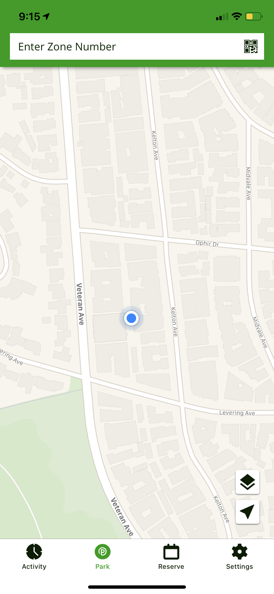
  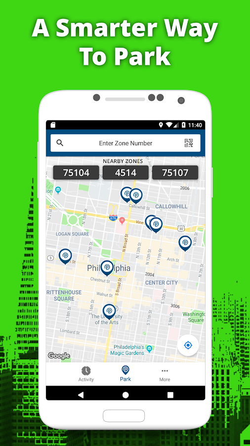
  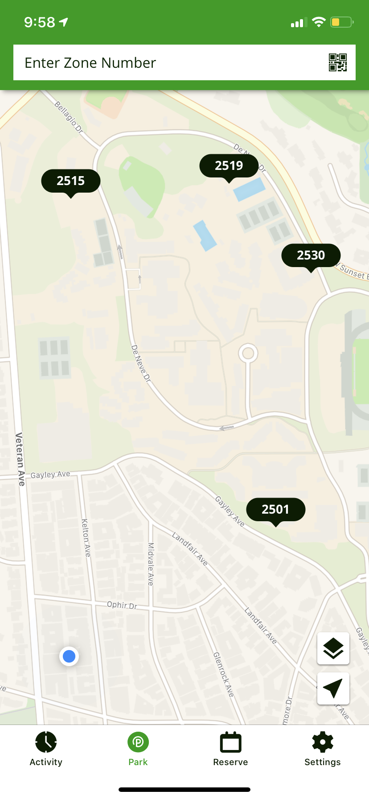

**2. Match between system and real world (1)** 
>Within the mobile application, the user sees a map that they should be quite familiar with, as it is similar to the standard mobile map applications (Google Maps, Apple Maps, etc.) that many people use. The map has two icons, two flat stacked squares indicating the ability to change map layers, as well as an arrow in a box, indicating the ability to return the map orientation to the user’s current location. At the top of the main screen, there is a rectangular box with the text “Enter Zone Number” — however, for users who are not familiar with the application, “zone number” is not easily understandable unless they know that each parking zone has an affiliated number. Additionally, it may not be fully clear that the box is “searchable” without the inclusion of the magnifying glass symbol used to indicate searchability. Finally, it is not immediately clear that clicking on the small QR Code symbol in the box will result in the use of the camera to scan a code, though once a user discovers this function, it is quite intuitive. This issue simply arises because new users are not aware that parking zones can be identified with QR codes or where these codes are located.

**3. User control and freedom (1)**
>When one begins the process of paying for parking (i.e. they have selected the zone in which they want to park by entering a zone number or by clicking on the number that initially comes up), they face the initial payment screen. At this point, the user has the freedom to exit this screen by clicking on the “back” arrow in the top left corner. The arrow being in the top corner of the application is quite standard within the app, though the appearance of the arrow does vary. In the paying for parking section of the application, it is black and has a tail ( ← ) (_first image_) vs. in other sections such as the "Settings" screen, it is green and has no tail ( < ). Otherwise, the user can exit any activity they are conducting in the application by closing it. Additionally, this application also allows users to narrow down their search when looking to reserve parking spots in advance — this is accomplished on the “Reserve” screen by clicking on the “Filter” button in the top right corner, which permits users to choose from a variety of options they would like their parking lot to have, whether covered parking, valet, or handicap accessible (_second image_).

  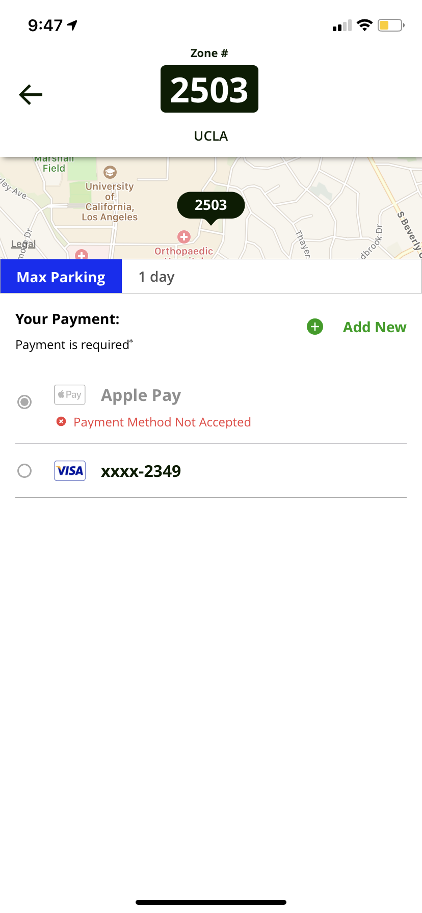
  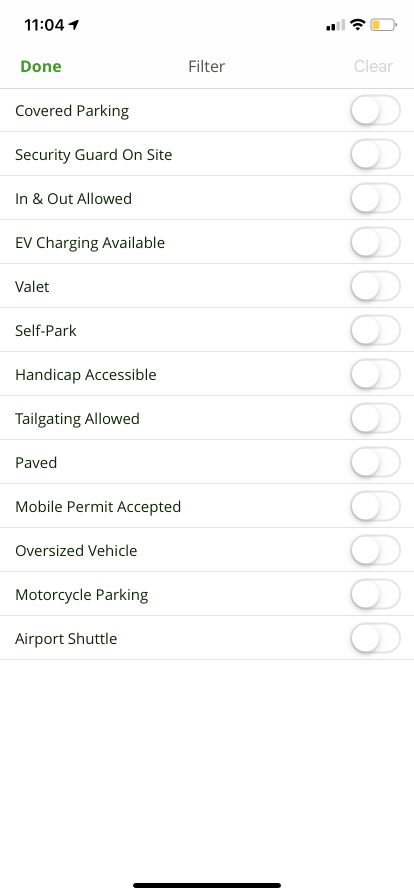

**4. Consistency and standards (3)**
>There is some visual inconsistency within the application. Similarly to the “Park” screen, the “Reserve” screen also has a search bar at the top. However, this search bar stretches fully across the top of the screen and is not surrounded by a green outline like it is in the “Park” screen. Additionally, this search bar is somewhat larger and has the guiding magnifying glass symbol indicating the ability to search. The “Reserve” screen also has a small button in the top right corner that says “List” and is accompanied by a small list symbol. However, because the “Park” screen (the more commonly used of the two) does not have such a symbol, it is not immediately clear to the user what this list could consist of. However, if a user finds themselves in the vicinity of a place (or searches for such a place) where parking can actually be reserved through the ParkMobile app, such as the Hollywood Pantages Theater, they will see various icons on the screen indicating that ParkMobile is accepted there. For example, the theater has an icon with the outline of a ticket, while regular parking lots simply have a price (i.e. $12) in a circle. Another inconsistency includes the fact that users who are used to swiping back and forth between screens (like on social media applications or web browsers) are not able to do so on all screens of ParkMobile. In the “Settings” screen, users are able to click on various subsections and then swipe back, but in the “Activity” screen, users cannot swipe to move between the three sections (“Activity”, “Upcoming” and “History”), which is unusual to experience (_see "Help users recognize errors" section_). Overall, however, the application is largely consistent with accepted standards of icon imagery and wording. 

  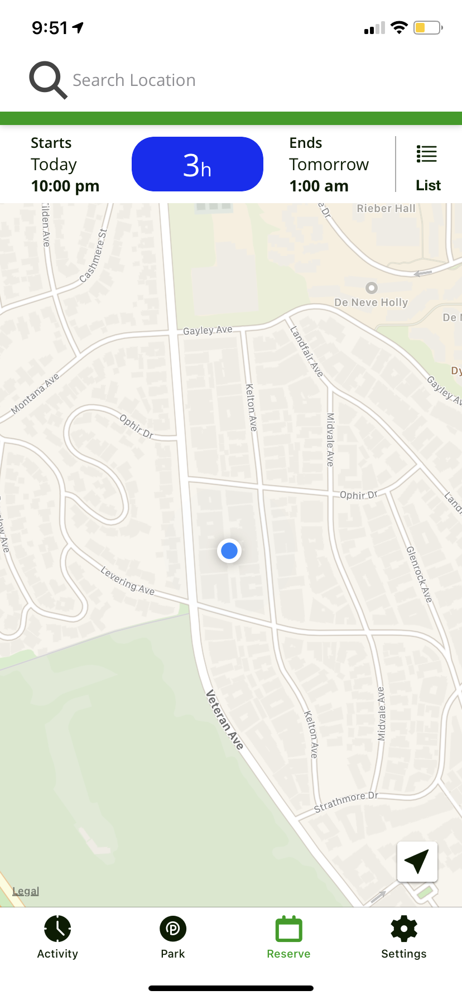

**5. Error prevention (3)**
>One method of error prevention in ParkMobile is the alert that prevents me from attempting to pay with Apple Pay in zones in which this payment method is not accepted (_see image in "User control and freedom" section_). However, ParkMobile does set Apple Pay as the default payment method and I am unable to change it, which is problematic for users. Additionally, ParkMobile does not allow users to make reservations for parking spots in the past. There is, however, no error prevention designed with geographic barriers in mind. For example, I could be sitting at home and still be able to pay for parking in Parking Structure 2 at UCLA while my car is parked on the street several miles away. It would be better for the user if there was an alert that triggered when the user was far away from the geographic location of the parking zone they selected asking “Are you sure you’d like to park here? You are located X miles away from this parking zone” which may prevent erroneous payments for the user and complications for the parking garage attendants keeping track of those who park in the zones.

  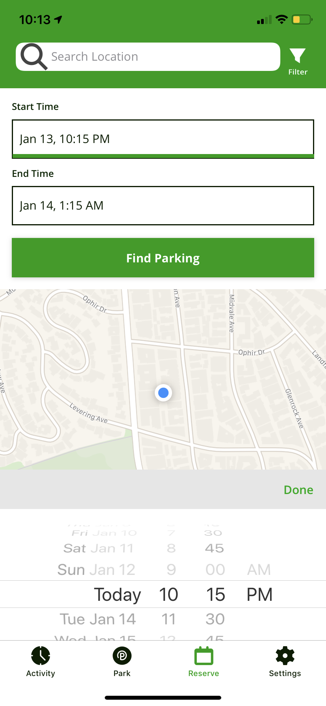

**6. Recognition rather than recall (1)**
>ParkMobile provides users with a history of zones they have parked in the “History” tab of the “Activities” section. Additionally, when one clicks on the “Enter Zone Number” box at the top of the “Park” screen, an additional screen comes up with tabs that show both “Favorite” and “Recent” parking zones. This screen is helpful for most users, but somewhat redundant for those who park in only one zone, like myself.

  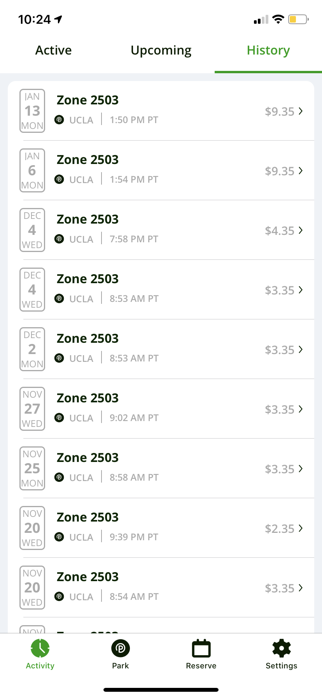
  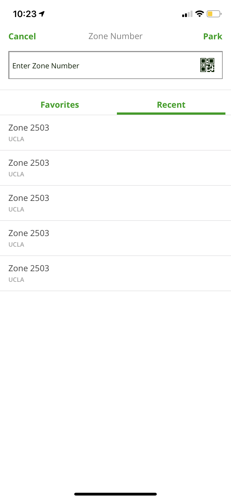

**7. Flexibility and efficiency of use (3)**
>All users are able to receive the same general experience regardless of their level of proficiency and experience with the ParkMobile application, primarily due to the simplicity of its functionality. However, users are able to sign up for ParkMobile Pro, a premium version of the application that costs $0.99 a month. In ParkMobile Pro, users get additional functionality like real-time parking availability, reduced transaction fees, discounts on car-related services from ParkMobile partners, and dedicated customer support. This paid version of ParkMobile is less about the premium functionality of the application than about the incentive to purchase services from ParkMobile partners, though it is possible with a greater number of  users, ParkMobile could expand the additional functionality it offers. When it expands the functionality, it can consequently gain more new premium users.

  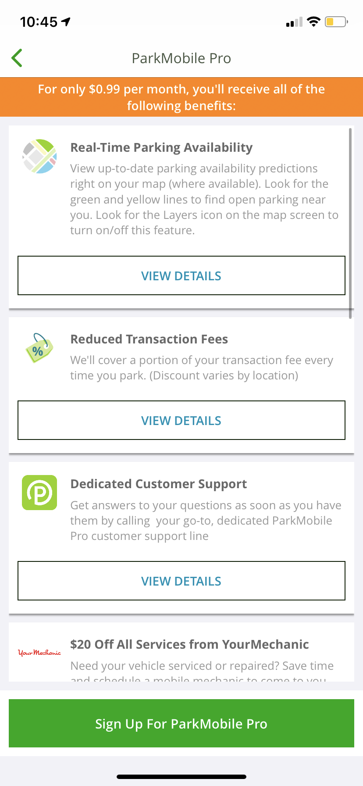
  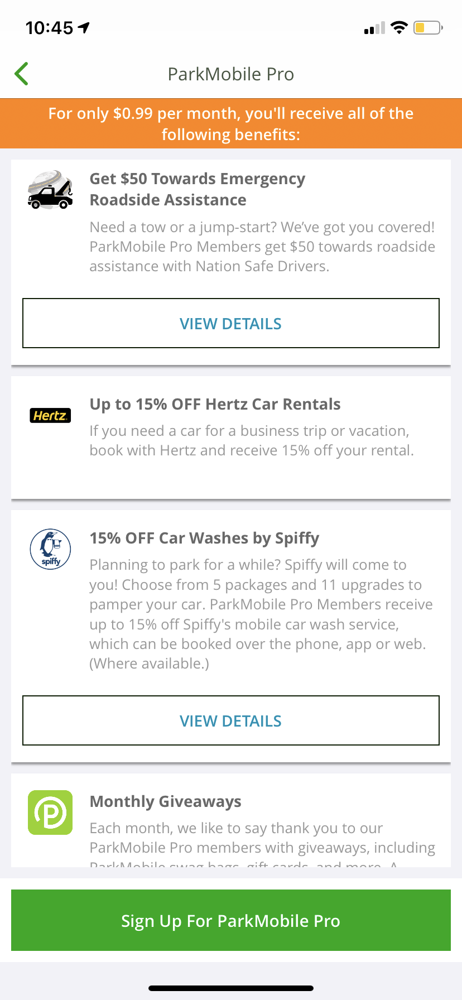
  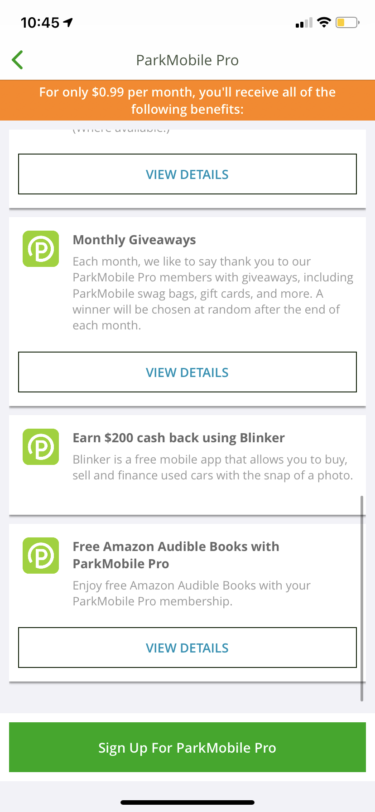

**8. Aesthetic and minimalist design (2)**
>ParkMobile has a relatively minimalist design, though certain settings can become overwhelming for users (for example, if a user accidentally zooms out and views all the available ParkMobile parking locations in the United States). Generally, ParkMobile has a consistent color scheme (green and white) and design throughout other than the few previously mentioned inconsistencies. The navigation bar at the bottom only has 4 icons and they are labeled with one word according to their function, which is helpful for users even though the icons are relatively intuitive. One visually unappealing element is the search symbol on the “Reserve” screen (_see image in "Consistency and standards" section_), which is too large for the search bar in which it is placed.

  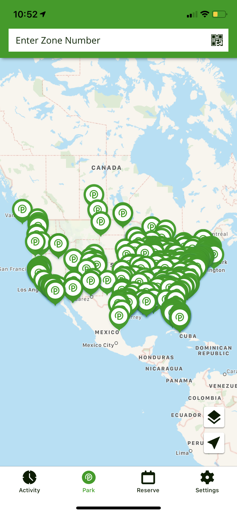

**9. Help users recognize, diagnose, and recover from errors (2)**
>There are several “error” screens within ParkMobile that are quite clear with their user instructions. In the “Activity” screen, both the “Active” and “Upcoming” subscreens have messages that let the user know to start a parking sessions or reserve a parking spot, then return to that screen to view their active parking sessions or upcoming reservations. Another error message that comes up is the “No Matching Zones” message when a user attempts to put in an incorrect zone number. In the “Reserve” section, if you attempt to view a list of reservable places and there are none near you or in the area you are searching, ParkMobile returns a message recommending that the user “check back soon for new lots. In the meantime, look at the PARK tab to find Zone **Park**ing when you get to your destination.” ParkMobile has recently done well to reduce the errors a user (like me) encounters in the application since previously the application had many glitches without offering error screens or explanations.

  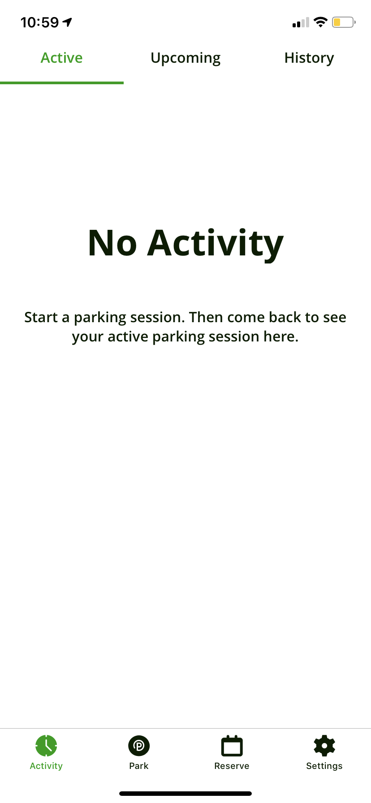
  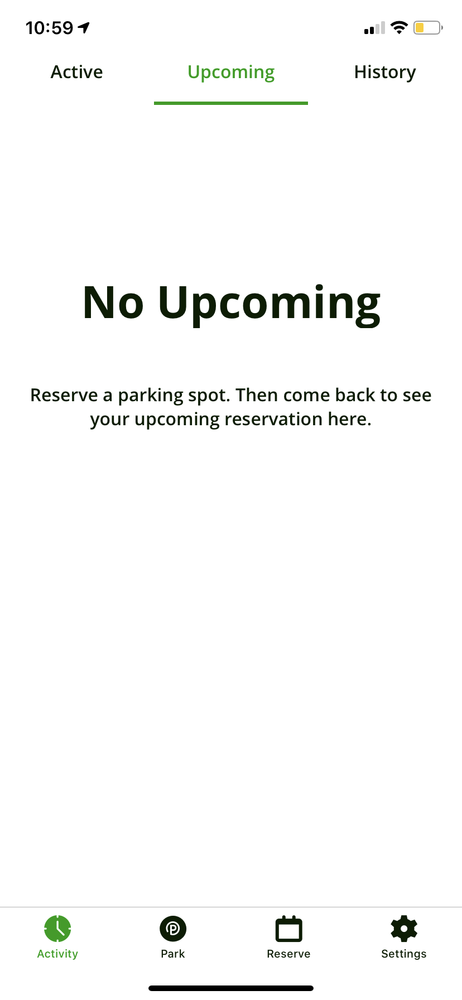
  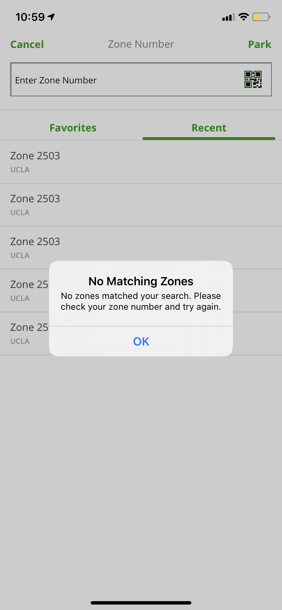
  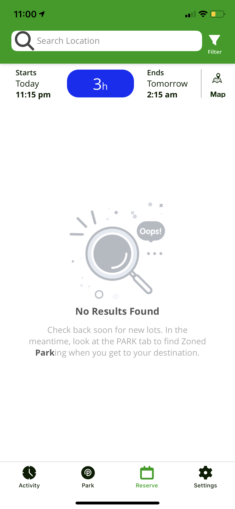

**10. Help and documentation (1)**
>ParkMobile has both “Help” and “Chat” functions that allow users to get more information from Frequently Asked Questions and resolve issues in real-time. The ParkMobile FAQ/Help section is searchable and provides much useful information (though it is quite lengthy), while a support chat stays open while the user navigates the application, until the user clicks “End Chat” in the top right corner.

  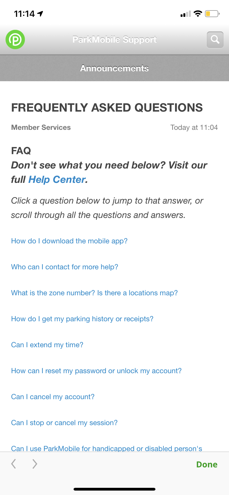
  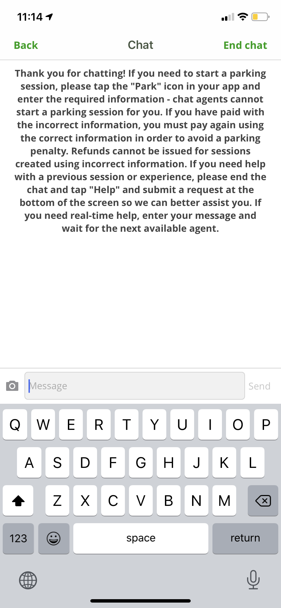

## :sparkle: Further Ideas :sparkle:
In the future, it would be interesting to see more information about each parking zone prior to arriving at it or clicking into it. I think visually, it may be helpful to users to indicate certain characteristics using colors or symbols floating above each zone number indicating for example, that long-term parking is available at this location, that this is an uncovered parking lot, or, with a $, $$, or $$$, what the price range of this lot is. 

Additionally, ParkMobile could explore predictive suggestions for users on where to drive to and park based on their most visited locations. For example, since I am a UCLA student and only park at UCLA, ParkMobile could make the suggestion for me to visit student-friendly places (like a museum, mall, etc) where I can at once use ParkMobile and have a new expeirence. With this, ParkMobile could perhaps partner with certain locations like stadiums and concert venues to offer discounts on parking to PM users, or to attract visitors to events like Smorgasburg.

Similarly, an integration with applications like Google Maps and Waze would be very helpful to users, especially those that are traveling to a location they are not familiar with.
