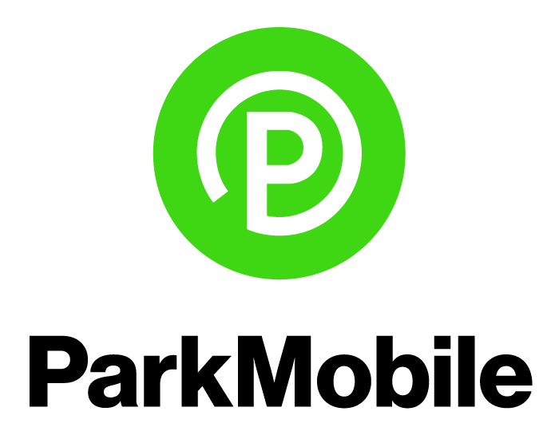

# DH150 Assignment 2: Usability Testing

### _by Tasia Mochernak // Digital Humanities 150 at UCLA, Winter 2020 // Dr. Sookie Cho // 1.21.2020_

## Introduction

ParkMobile is a free mobile application (both iOS and Android) that allows users to find, reserve, and pay for parking from their mobile devices. ParkMobile partners with parking providers like college campuses, event venues, stadiums, and airports to provide easy parking solutions for both direct users of the application and these parking providers themselves. For reference, ParkMobile is the parking system used by UCLA, which I personally began using since the payment machines in the parking garages are often unable to process credit card payments and require exact payment in cash as they do not provide change. 

  

## Usability Test

The usability test (UT) was conducted to better understand whether or not certain issues identified in the heuristic evaluation, found [here](https://github.com/tasiamochernak/DH150W2020/blob/master/assignment1.md), were significantly impactful to the user experience. Some of the issues I had previously identified with high severity rankings had to do with consistency and standards, error prevention, and flexibility and efficiency of use. Specifically, with this UT, I wanted to examine whether or not visual inconsistencies within the application would disrupt a user from completing certain tasks; whether or not a user was adequately protected by the application from making costly mistakes (i.e. making a reservation with the wrong payment method or paying for parking at a location they were not currently at); and finally, whether or not a user could easily find more information about additional features for which they could pay a reasonable amount of money. The overall purpose of the usability test was to determine how to improve the ParkMobile application from the user’s perspective. 

### Methodology

I conducted this usability test in-person with an individual who approximately fit the characteristics of a target user of ParkMobile in Los Angeles — college-aged student, legally able to drive in the United States, interested in exploring more of LA if in possession of a car. Only the test administrator and the participant were present in the room. The participant undertook the tasks utilizing the ParkMobile app on my phone (iPhone XR) while it was screen-recording. Additionally, the participant’s facial expressions and usability questionnaire answers were recorded via webcam and screen-recording on my laptop, respectively, using ActivePresenter software. All three video components, together with audio, were combined together using ActivePresenter, and the full video can be found at the link below.

This usability test was part of a pilot process in order to test the setting, the usability test materials, and the software. The session took approximately 20 minutes to complete. 

During the test, I (the administrator) explained the test session rules and regulations and asked the participant to consent to the recording of and sharing of the content of the usability test. Then, I asked the participant a few background and pre-test questions, followed by reading out three tasks for the participant to complete, and closed off with post-test questionnaire, system usability scale questions, and a product satisfaction evaluation. Finally, the participant filled out demographic data about themselves without the screen-recording. 
* **Background questions:** These questions asked the user their history of using ParkMobile (or lack of it) and what operating system they do or would use it on if applicable.
* **Pre-test questions:** These questions asked how easy or difficult to use and how straightforward did the ParkMobile application look to use. The participant rated the app based on each of these characteristics on a Likert scale from 1 to 7.
* **Task 1:** Paying for parking at a UCLA parking lot by searching for Parking Structure 2, adding a new payment method, and choosing to park for 2 hours.
* **Task 2:** Reserving parking at the Hollywood Pantages by searching for the Hollywood Pantages Theatre, choosing a parking option with a security guard on site, and getting directions to the parking lot of choice.
* **Task 3:** Finding more information about premium ParkMobile features by searching for this information and learning more about real-time parking availability and additional benefits for ParkMobile Pro members.
* **Post-test questionnaire:** These questions, related to each task, asked how easy or difficult it was to perform each one, how much time it took, and how likely the participant was to do each task.
* **System Usability Scale:** These questions measured how much the participant agreed with each statement, including whether or not the application was cumbersome to use and whether or not they felt like they needed the help of a technical expert to use it.
* **Product satisfaction card:** These questions identified the 5 adjectives that most closely matched the participant’s personal reactions to the app. 
* **Demographic data:** These questions asked the participant’s age, gender, ethnicity, occupation, primary language, and whether or not they were able to legally drive in the US.

Overall, the test was done to determine how understandable, simple to use, and straightforward the application is for first-time users.

## :sparkle: Test Materials
Find the usability test materials [here](https://forms.gle/k9XgnefrKoiYHJW97)!

## :sparkle: Pilot Usability Test Video
View and/or download the ParkMobile usability test pilot video [here](https://drive.google.com/file/d/12I5Oj3TOP9QuMMn9MKAv4pSEUOB4o-Tb/view?usp=sharing)!

## :sparkle: Reflection
 **What I learned during the pilot test**

The pilot usability test was very informative for me because it brought me back to the perspective of a first-time user of the application that we tested, ParkMobile. I remember that when I first started using the application, I was often a bit frustrated with some of the app’s functionality and errors that I faced, though I continued using it because it was my only option. Watching the participant occasionally click certain buttons and not receive any results, but still be able to complete the tasks that I set him in full, reminded me that both the application and the user have the responsibility to think using common sense, though if certain tasks take the user unnecessarily long (such as choosing 2-hour parking), that is likely more of the app’s fault. I could also feel that the participant was somewhat nervous and wanted to “do well,” which highlighted for me the importance of making the usability test environment relaxed and welcoming and demonstrated that some of the actions the participant undertook may have been skewed by the desire to perform well while his actions were being recorded.

**What went well and what did not go well**

The participant completed all the tasks! Although with some of the tasks, the participant did not quite hit every component of the process that I had hoped he would; this was partially due to the fact that some of my information was already included in the app, and I was unable to clear it prior to the test. Otherwise, everything else went well. 

**How to improve my UT in the future**

I would consider guiding the participant slightly less (i.e. allowing them to read out the questions on their own or perhaps click the survey answers on their own) in order to provide them with more freedom and so I can get a better, more natural sense of how the participant uses the app without another person watching over them. Additionally, I would like to conduct the usability test with a “brand new” app that does not have any information entered, so the participant cannot take any shortcuts and there is no fear of the participant accidentally paying for something.
